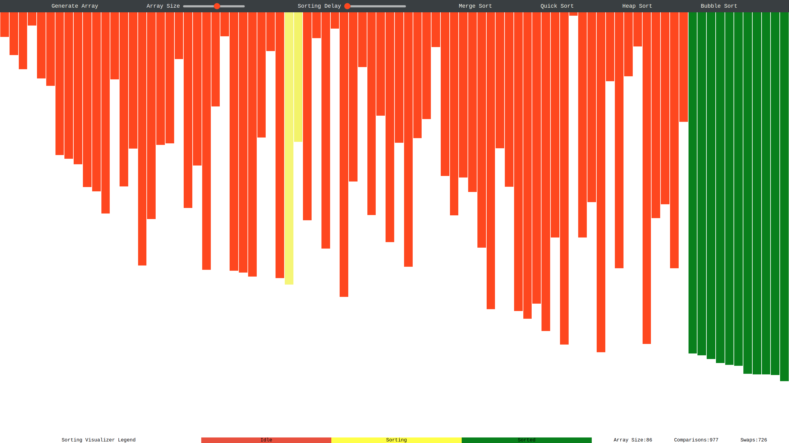

# Sorting Visualizer

- This is a single page application that attempts to visualize some well-known sorting algorithms.

# So far

## WorkLog

- Start implementing the skeletons:
  - Bootstrap using `npx create-react-app`
  - Get the layout first (cos a CSS ignoramus)
- Implement a heder for tool-bar
  - Generate rand array
  - Make array size inputtable
  - Make dummy buttons for algo(s)
  - Handle styling
- Implement the main(array) container
  - Implement random arr function
  - Get them divs goin
  - Handle styling
- Implement bubble sort (cos logarithmic) first.
  - Implement the algo
  - Implement the index tracing
  - Handle styling
- Make sort delay inputtable
- Disable stuff when things running
- Make a footer (app label, legend, running info[arraysize, comparison and swap count])

## References
- This work is 100% not __ORIGINAL__ and benefits the existence of some referential precedents:
- [clementmihailescu](https://github.com/clementmihailescu/Sorting-Visualizer)
- [sadanandpai](https://github.com/sadanandpai/sorting-visualizer)
- [Tamerlan](https://www.youtube.com/watch?v=7imRzxevHL8)

